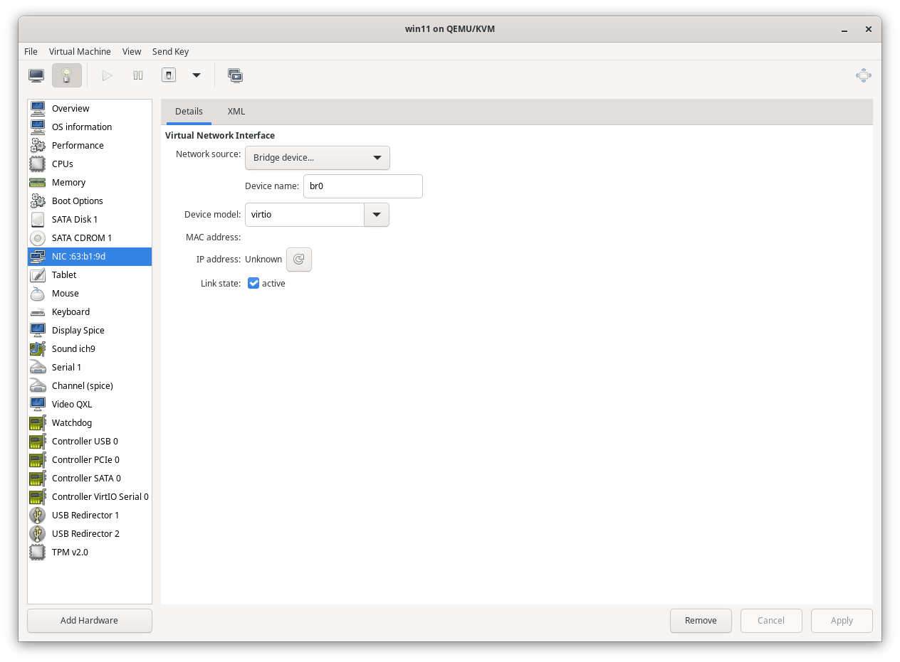
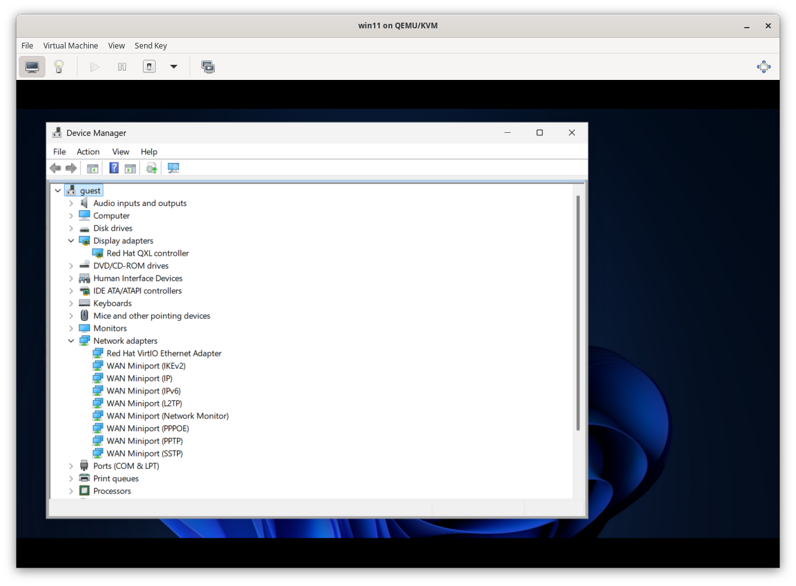
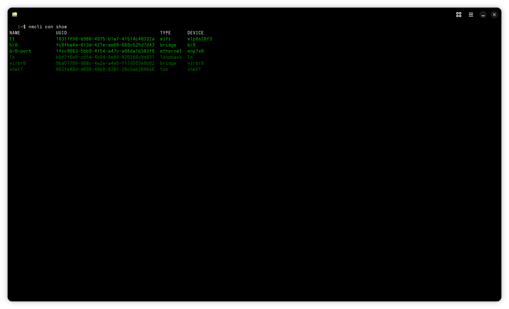
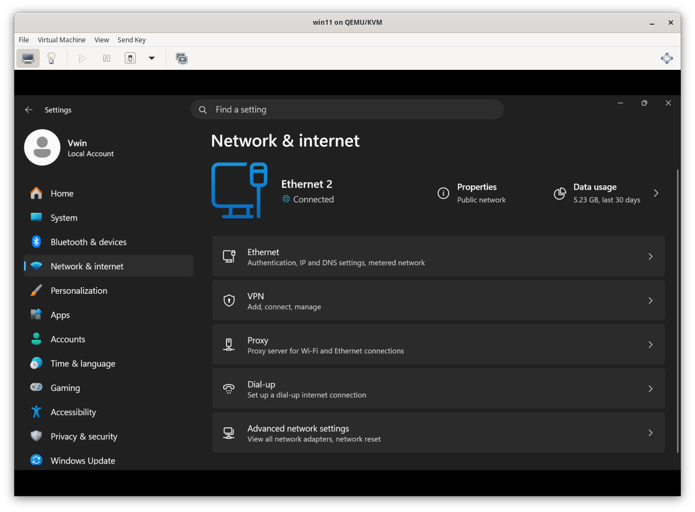

#  Isolated KVM Networking: The Dedicated Ethernet Bridge
> **Scenario:** Give a Windows VM a direct physical line to the internet via Ethernet while keeping the Linux Host isolated on WiFi.

---

# Important NOTE:

(`wlp0s20f3`) and (`enp7s0`) are MY interfaces it will usually be  different for u 
so replace the  (`enp7s0`) in the commands by the name of the ethernet interface of yours
***And to know the name of the interface run this***
(`nmcli`)

_the name will normally begine with e (stands for ethernet)_

---

##  The Micro-Logic (The Hardware Flow)
| Component | Logical Role | The "What For" |
| :--- | :--- | :--- |
| **`br0`** | Virtual Switch | A power strip in RAM. It doesn't have an IP; it just passes traffic. |
| **`enp7s0`** | Physical Plug | The "Uplink." The physical wire plugged into the wall router. |
| **`vnet0`** | Virtual Cable | The ghost wire that appears when the VM starts to plug into `br0`. |

---

## Step 1: The Linux Host Setup
Follow these steps to build the "Switchboard" and ensure the Host OS doesn't "steal" the connection.

### 1. Building the "Switch"
```bash
sudo nmcli con add type bridge ifname br0 con-name br0
```
* **Why:** Think of this as unboxing a physical 5-port network switch. Right now, it's just sitting on your desk (RAM) and isn't plugged into anything yet.

### 2. Connecting the Switch to the Real World
```bash
sudo nmcli con add type bridge-slave ifname enp7s0 con-name br0-port master br0
```
* **Why:** You are taking an Ethernet cable and plugging one end into your Laptop's Port (`enp7s0`) and the other into your New Virtual Switch (`br0`).

### 3. Silencing the host (The Isolation)
```bash
sudo nmcli con modify br0 ipv4.method disabled
```
* **Why:** You have to tell the host : "Don't use this switch to get an IP for yourself." This leaves the entire "pipe" open for the VM.

---

### Note:
Before going to **step 2** _Run this:_ (`nmcli con show`)  IF you saw something similar to this line:
***`Wired connection 1  	04b0e...  	ethernet  	--`***  => __Then go to **step 2**__

---

##  Step 2: Fixing the "Logic Gap" (Troubleshooting Hardware)
Sometimes the host has a "Loose Connection" (like *Wired connection 1*) that holds onto your hardware and prevents the bridge from working. 

### 1. Delete the "Loose" Connection
```bash
sudo nmcli con delete "Wired connection 1"
```
* **Why:** We need to clear the profile so the hardware (`enp7s0`) is free.

### 2. Enslave the Hardware to the Bridge
```bash
sudo nmcli con add type ethernet slave-type bridge con-name br0-port ifname enp7s0 master br0
```
* **Why:** This is the "surgery." We are telling the physical hardware: "You no longer report to the OS. You now report to the Switch (`br0`)."

---

##  Step 3: Connecting the VM to the Switch
1. Open **Virt-Manager** -> VM Settings.
2. Select the **NIC (Network Interface)**.
3. Set **Network Source** to `Bridge device...`.
4. Type **`br0`** into the Device Name field.
* **The Logic:** This is like taking a virtual Ethernet cable from your Windows 11 VM and plugging it into a spare port on your Virtual Switch (`br0`).


---

### NOTE:
After that if the internet didn't work on the VM then follow step 4  

---

## Step 4: The Windows Driver "An easy way"   ***(Optional)***

### How to install via Folder/USB:
1. **Download:** Click on [drivers.zip](drivers/drivers.zip) and then select **"View raw"** (or the Download icon) to save the file and put it on a usb drive and plug it out then in agian while the VM is running to take the files from it
2. Open **Device Manager** in Windows.
3. Right-click the **Ethernet Controller** (with the yellow warning sign).
4. Select **Update Driver** -> **Browse my computer for drivers**.
5. Point it to the `drivers/NetKVM/w11/amd64` folder.

---

### Another Note:
IF you can't change the display resloution then update the drivers of the display adapter the same way from device manager but this time point it to `drivers/qxldod/win10&win11/amd64` folder. 

**The (`drivers.zip`) file that i attached in this repo has both the `NetKVM` (for network card) and the `qxldod` (for display adapter) folders**

---

### Your display and network adapters on the VM should now have no yellow marks like this:



---

## The WiFi Trap
**Never attempt to bridge a WiFi card (`wlp0s20f3`).**
WiFi is a "secure tunnel" that only allows **one** MAC address at a time. If the VM tries to send its identity through your WiFi card, the router assumes it's a hack and kills the connection. **Always use a cable for bridging!**

---

# At the end run this:
***(`nmcli con show`)***

## You will see something like this:-



## Your ethernet connection on the VM will look like this:-



## The _IP address_ on the VM should be ***different*** from the host's _IP address_.

.png)


